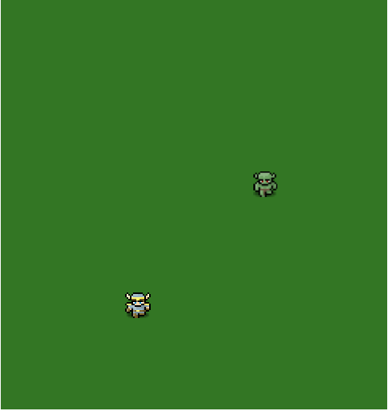

# My Little RPG
# [Live Link](https://eihcir0.github.io/my_little_rpg)
## Background

Kill Monsters!  Find Gold!  Level up!

Inspired by games like Zelda and other RPG games, My Little RPG is a fun project completed over the course of 4 evenings and my first experience working with sprite animation.  

## Features
My Little RPG features:

1. A character which can be controlled with the arrow keys along with space bar and S.
1. Collision detection between all moveable and non-moveable objects and the edge of the canvas
1. Vector math to calculate trajectories of objects.
1. Currently character can level up three times.  Stronger stats and fireballs available at higher levels.

## Wireframes
This app will consist of a single screen which contains a title, attributes, and a HTML canvas element.



## Architecture
This app was created entirely in JavaScript using mostly ES6 syntax.  HTML5 canvas was used for the graphic elements.  No libraries were used.  Everything from collision detection to sprite animation was handrolled from scratch.

## Sample Code

### Request Animation Frame

To avoid efficiency problems with using setTimeout(), requestAnimationFrame() was used in the main game loop and bootstrapped

```

var requestAnimationFrame =
	window.requestAnimationFrame ||
	window.webkitRequestAnimationFrame ||
	window.msRequestAnimationFrame ||
	window.mozRequestAnimationFrame;

function main() {

    var dt = (Date.now() - lastTime);

    handleInput(game.hero, keysDown);
    game.update(dt);
    game.render();


    lastTime = Date.now();
    requestAnimationFrame(main);
```


### Sprite Offsets When for Sword Swing animation

One of the many challenges along the way was attributable to the fact that the sprite sheet which was used had 32px sprites but the sprites for sword swinging were 3 times as large.  To account for this, offsets were passed to the render function.

```
render() {
  if (this.attacking) {
    this.ctx.drawImage(
    this.image,
    (this.animSet * (this.width * 3 * this.animNumFrames)) +
    (this.animFrame * this.width * 3),
    this.spriteYoffset*this.height*3,
    this.width*3,
    this.height*3,
    this.pos[0] + this.attackXoffset,
    this.pos[1] + this.attackYoffset,
    this.width*3,
    this.height*3
    );
    ```

### Move() function
```

move(elapsed) {
  let newPos = this.pos.slice(0);
  if (this.movementOn) {
    var move = (this.speed * (elapsed / 1000));
    let speedFactor;

    if (this.DIAGS.includes(this.facing)) { //reduce diag velocity
        speedFactor = 0.75;
    } else {
      speedFactor=1;
    }
      newPos[0] += Math.round(move *  this.MOVES[this.facing][0]);
      newPos[1] += Math.round(move * speedFactor * this.MOVES[this.facing][1]);
    }
  }

  ```

### Class Inheritance Structure
To group functions common to all classes, I created a Moveable class and an Immoveable class.  This allowed me to DRY up my codebase and functions common to all moving objects.

Parent class     | Children | Comments
----------------|-----------|-----------------------
App              | --   | Contains initial game setup logic.  Instantiates new Game
Game        | --    | Instantiates hero and quadrants. Contains main game loop.  Updates monsters in all quadrants but on renders quadrant player is on.
Quadrant | --    | Instantiates board.  Handles collision checking logic.
Board | --    | Instantiates and tracks immoveable objects and doorways to other quadrants.
Moveable | Hero, Monsters    | Handles updates for movement and animation for all moveable objects.
Monster | Greeny, SkullGuy | Handles all monster damage
Immoveable | Tree, Door | Doors know where they go and the position of the Hero when entering the new quadrant.
